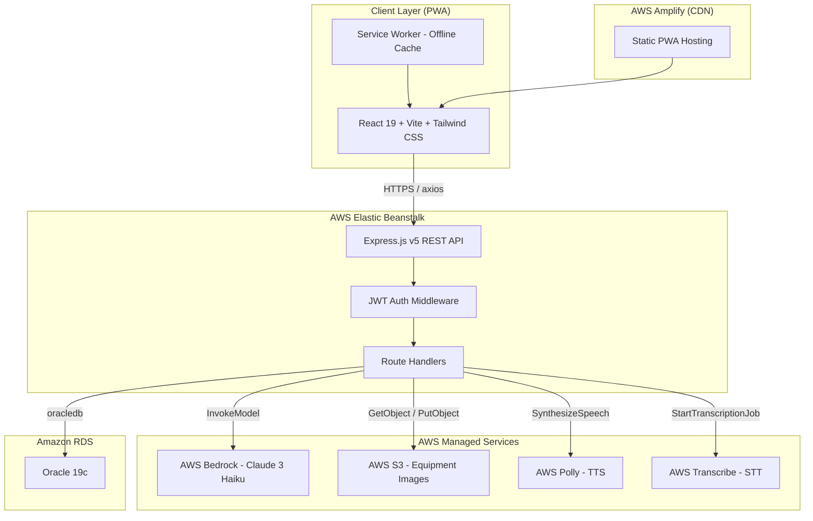
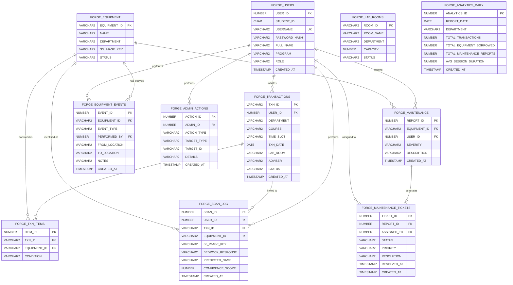

# FORGE System Design Document

## Overview

FORGE (Facility Operations and Resource Governance Engine) is a cloud-native, multimodal Progressive Web App for lab equipment management at TIP-Manila. The system follows a mobile-first, full-stack architecture with a React frontend hosted on AWS Amplify, an Express.js backend on AWS Elastic Beanstalk, and an Oracle 19c database on Amazon RDS. AWS services (Bedrock, S3, Polly, Transcribe) power the AI and multimodal features.

The design prioritizes:
- Touch-inefficient environments (gloved hands, occupied hands)
- ACID-compliant transaction integrity for concurrent borrowing
- Multimodal HCI (voice, vision, touch) throughout the borrowing flow
- Mobile-first responsive layout with desktop adaptation

---

## Architecture



---

## Components and Interfaces

### Frontend Components

```
frontend/src/
├── main.jsx                    # React entry point
├── App.jsx                     # Router + auth guard
├── index.css                   # Global styles + Tailwind
├── assets/
│   └── forge-logo.png          # FORGE logo
├── components/
│   ├── ui/
│   │   ├── Badge.jsx           # Status badges (ACTIVE, IN SESSION, etc.)
│   │   ├── ProgressBar.jsx     # Time-remaining progress bar
│   │   ├── StepIndicator.jsx   # Dot-based step progress (1/4, 2/4...)
│   │   └── TTSToggle.jsx       # TTS on/off toggle button
│   └── layout/
│       ├── MobileHeader.jsx    # Mobile top bar with back + TTS + step
│       └── WebHeader.jsx       # Desktop nav bar with logo + links
├── pages/
│   ├── LandingPage.jsx         # Public landing page
│   ├── SignIn.jsx              # Sign in form
│   ├── SignUp.jsx              # Sign up form
│   ├── Dashboard.jsx           # Student dashboard
│   ├── borrow/
│   │   ├── BorrowStep1.jsx     # Department selection
│   │   ├── BorrowStep2.jsx     # Borrowing details form
│   │   ├── BorrowStep3.jsx     # AI scanner
│   │   └── BorrowStep4.jsx     # Review summary
│   ├── LogUpdated.jsx          # Transaction confirmation
│   ├── MyTransactions.jsx      # Transaction list
│   ├── ReportMaintenance.jsx   # QR scan + maintenance form
│   ├── admin/
│   │   ├── AdminDashboard.jsx  # Admin overview (stats, alerts)
│   │   ├── EquipmentManagement.jsx  # CRUD equipment inventory
│   │   ├── TransactionOversight.jsx  # View all transactions, override status
│   │   ├── MaintenanceTickets.jsx    # Manage maintenance workflow
│   │   ├── UserManagement.jsx        # View/disable users
│   │   ├── LabRoomManagement.jsx     # CRUD lab rooms
│   │   └── SystemReports.jsx         # Analytics and audit logs
│   └── OfflinePage.jsx         # PWA offline fallback
├── hooks/
│   ├── useAuth.js              # JWT auth state
│   ├── useTTS.js               # AWS Polly TTS integration
│   ├── useSTT.js               # AWS Transcribe STT integration
│   └── useClock.js             # Live clock (1s interval)
└── services/
    ├── api.js                  # axios instance + interceptors
    ├── authService.js          # Sign in / sign up / token refresh
    ├── transactionService.js   # Borrow, list, detail endpoints
    ├── scannerService.js       # AI scanner endpoint
    ├── maintenanceService.js   # Maintenance report endpoint
    └── ttsService.js           # Polly + Transcribe API calls
```

### Backend Structure

```
backend/
├── index.js                    # Express app + server entry
├── middleware/
│   └── auth.js                 # JWT verification middleware
├── routes/
│   ├── auth.js                 # POST /api/auth/signin, /signup
│   ├── dashboard.js            # GET /api/dashboard
│   ├── transactions.js         # GET/POST /api/transactions
│   ├── scanner.js              # POST /api/scanner/identify
│   ├── maintenance.js          # POST /api/maintenance
│   ├── tts.js                  # POST /api/tts/synthesize
│   ├── stt.js                  # POST /api/stt/transcribe
│   ├── equipment.js            # GET /api/equipment/image-url
│   └── admin/
│       ├── equipment.js        # GET/POST/PUT/DELETE /api/admin/equipment
│       ├── transactions.js     # GET/PATCH /api/admin/transactions (override status)
│       ├── tickets.js          # GET/POST/PATCH /api/admin/tickets
│       ├── users.js            # GET/PATCH /api/admin/users (disable/enable)
│       ├── rooms.js            # GET/POST/PUT/DELETE /api/admin/rooms
│       ├── analytics.js        # GET /api/admin/analytics
│       └── auditLog.js         # GET /api/admin/audit-log
├── db/
│   └── pool.js                 # Oracle connection pool
└── utils/
    └── txnId.js                # Transaction ID generator (TXN-YYYYMMDD-NNN)
```

### REST API Endpoints

| Method | Endpoint | Description |
|--------|----------|-------------|
| POST | /api/auth/signin | Authenticate user, return JWT |
| POST | /api/auth/signup | Register new student account |
| GET | /api/dashboard | Dashboard data (rooms, transactions, equipment) |
| GET | /api/transactions | List student transactions |
| POST | /api/transactions | Create new borrowing transaction |
| POST | /api/scanner/identify | Send image to Bedrock, return equipment ID + condition |
| POST | /api/maintenance | Submit maintenance report |
| POST | /api/tts/synthesize | Invoke Polly, return audio stream |
| POST | /api/stt/transcribe | Invoke Transcribe, return text |
| GET | /api/equipment/image-url/:id | Return pre-signed S3 URL |
| **Admin Endpoints** | | **Requires LAB_ADMIN role** |
| GET | /api/admin/equipment | List all equipment with filters |
| POST | /api/admin/equipment | Create new equipment |
| PUT | /api/admin/equipment/:id | Update equipment details |
| DELETE | /api/admin/equipment/:id | Mark equipment as disposed |
| GET | /api/admin/transactions | List all transactions (all users) |
| PATCH | /api/admin/transactions/:id | Override transaction status |
| GET | /api/admin/tickets | List maintenance tickets |
| POST | /api/admin/tickets | Create ticket from maintenance report |
| PATCH | /api/admin/tickets/:id | Update ticket status/assignment |
| GET | /api/admin/users | List all users |
| PATCH | /api/admin/users/:id | Disable/enable user account |
| GET | /api/admin/rooms | List lab rooms |
| POST | /api/admin/rooms | Create lab room |
| PUT | /api/admin/rooms/:id | Update lab room |
| DELETE | /api/admin/rooms/:id | Deactivate lab room |
| GET | /api/admin/analytics | Get system analytics (daily rollup) |
| GET | /api/admin/audit-log | Get admin action audit trail |

---

## Data Models

### Oracle DB Schema

```sql
-- Users table
CREATE TABLE FORGE_USERS (
    USER_ID       NUMBER GENERATED ALWAYS AS IDENTITY PRIMARY KEY,
    STUDENT_ID    CHAR(7),           -- 7-digit numeric student ID
    USERNAME      VARCHAR2(100) UNIQUE NOT NULL,
    PASSWORD_HASH VARCHAR2(255) NOT NULL,
    FULL_NAME     VARCHAR2(200) NOT NULL,
    PROGRAM       VARCHAR2(200),
    ROLE          VARCHAR2(20) DEFAULT 'STUDENT' CHECK (ROLE IN ('STUDENT', 'LAB_ADMIN')),
    CREATED_AT    TIMESTAMP DEFAULT SYSTIMESTAMP
);

-- Equipment table
CREATE TABLE FORGE_EQUIPMENT (
    EQUIPMENT_ID  VARCHAR2(20) PRIMARY KEY,  -- e.g. EQ-7167
    NAME          VARCHAR2(200) NOT NULL,
    DEPARTMENT    VARCHAR2(50) NOT NULL,
    S3_IMAGE_KEY  VARCHAR2(500),
    STATUS        VARCHAR2(20) DEFAULT 'AVAILABLE'
);

-- Transactions table
CREATE TABLE FORGE_TRANSACTIONS (
    TXN_ID        VARCHAR2(30) PRIMARY KEY,  -- TXN-YYYYMMDD-NNN
    USER_ID       NUMBER REFERENCES FORGE_USERS(USER_ID),
    DEPARTMENT    VARCHAR2(50) NOT NULL,
    COURSE        VARCHAR2(100) NOT NULL,
    TIME_SLOT     VARCHAR2(50) NOT NULL,
    TXN_DATE      DATE NOT NULL,
    LAB_ROOM      VARCHAR2(20) NOT NULL,
    ADVISER       VARCHAR2(200) NOT NULL,
    STATUS        VARCHAR2(20) DEFAULT 'ACTIVE' CHECK (STATUS IN ('ACTIVE', 'PENDING_RETURN', 'CLAIM_ID', 'RETURNED')),
    CREATED_AT    TIMESTAMP DEFAULT SYSTIMESTAMP
);

-- Transaction items (equipment per transaction)
CREATE TABLE FORGE_TXN_ITEMS (
    ITEM_ID       NUMBER GENERATED ALWAYS AS IDENTITY PRIMARY KEY,
    TXN_ID        VARCHAR2(30) REFERENCES FORGE_TRANSACTIONS(TXN_ID),
    EQUIPMENT_ID  VARCHAR2(20) REFERENCES FORGE_EQUIPMENT(EQUIPMENT_ID),
    CONDITION     VARCHAR2(20) CHECK (CONDITION IN ('Excellent', 'Good', 'Fair', 'Poor'))
);

-- Maintenance reports table
CREATE TABLE FORGE_MAINTENANCE (
    REPORT_ID     NUMBER GENERATED ALWAYS AS IDENTITY PRIMARY KEY,
    EQUIPMENT_ID  VARCHAR2(20) REFERENCES FORGE_EQUIPMENT(EQUIPMENT_ID),
    USER_ID       NUMBER REFERENCES FORGE_USERS(USER_ID),
    SEVERITY      VARCHAR2(20) CHECK (SEVERITY IN ('Low', 'Medium', 'High', 'Critical')),
    DESCRIPTION   VARCHAR2(2000) NOT NULL,
    CREATED_AT    TIMESTAMP DEFAULT SYSTIMESTAMP
);

-- AI scan audit log (lightweight Bedrock call record)
CREATE TABLE FORGE_SCAN_LOG (
    SCAN_ID           NUMBER GENERATED ALWAYS AS IDENTITY PRIMARY KEY,
    USER_ID           NUMBER REFERENCES FORGE_USERS(USER_ID),
    TXN_ID            VARCHAR2(30) REFERENCES FORGE_TRANSACTIONS(TXN_ID),  -- Nullable; set after transaction is committed
    EQUIPMENT_ID      VARCHAR2(20) REFERENCES FORGE_EQUIPMENT(EQUIPMENT_ID),  -- Nullable; resolved equipment ID if match found
    S3_IMAGE_KEY      VARCHAR2(500),          -- S3 key of the captured image sent to Bedrock
    BEDROCK_RESPONSE  VARCHAR2(4000),         -- Raw JSON response from Claude 3
    PREDICTED_NAME    VARCHAR2(200),          -- Top predicted equipment name
    CONFIDENCE_SCORE  NUMBER(5,2),            -- e.g. 95.50
    CREATED_AT        TIMESTAMP DEFAULT SYSTIMESTAMP
);

-- Lab rooms table
CREATE TABLE FORGE_LAB_ROOMS (
    ROOM_ID       VARCHAR2(20) PRIMARY KEY,  -- e.g. A-101, B-205
    ROOM_NAME     VARCHAR2(200) NOT NULL,
    DEPARTMENT    VARCHAR2(50) NOT NULL,
    CAPACITY      NUMBER,
    STATUS        VARCHAR2(20) DEFAULT 'ACTIVE' CHECK (STATUS IN ('ACTIVE', 'MAINTENANCE', 'INACTIVE'))
);

-- Equipment lifecycle events (procurement, transfer, disposal)
CREATE TABLE FORGE_EQUIPMENT_EVENTS (
    EVENT_ID      NUMBER GENERATED ALWAYS AS IDENTITY PRIMARY KEY,
    EQUIPMENT_ID  VARCHAR2(20) REFERENCES FORGE_EQUIPMENT(EQUIPMENT_ID),
    EVENT_TYPE    VARCHAR2(20) CHECK (EVENT_TYPE IN ('PROCURED', 'TRANSFERRED', 'DISPOSED', 'CALIBRATED')),
    PERFORMED_BY  NUMBER REFERENCES FORGE_USERS(USER_ID),
    FROM_LOCATION VARCHAR2(200),  -- For transfers
    TO_LOCATION   VARCHAR2(200),  -- For transfers
    NOTES         VARCHAR2(2000),
    CREATED_AT    TIMESTAMP DEFAULT SYSTIMESTAMP
);

-- Admin action audit trail
CREATE TABLE FORGE_ADMIN_ACTIONS (
    ACTION_ID     NUMBER GENERATED ALWAYS AS IDENTITY PRIMARY KEY,
    ADMIN_ID      NUMBER REFERENCES FORGE_USERS(USER_ID),
    ACTION_TYPE   VARCHAR2(50) NOT NULL,  -- e.g. 'EQUIPMENT_CREATED', 'USER_DISABLED', 'TRANSACTION_OVERRIDDEN'
    TARGET_TYPE   VARCHAR2(50),  -- e.g. 'EQUIPMENT', 'USER', 'TRANSACTION'
    TARGET_ID     VARCHAR2(100),  -- ID of affected entity
    DETAILS       VARCHAR2(2000),  -- JSON or text description
    CREATED_AT    TIMESTAMP DEFAULT SYSTIMESTAMP
);

-- Maintenance ticket workflow
CREATE TABLE FORGE_MAINTENANCE_TICKETS (
    TICKET_ID     NUMBER GENERATED ALWAYS AS IDENTITY PRIMARY KEY,
    REPORT_ID     NUMBER REFERENCES FORGE_MAINTENANCE(REPORT_ID),
    ASSIGNED_TO   NUMBER REFERENCES FORGE_USERS(USER_ID),  -- Nullable; admin or technician
    STATUS        VARCHAR2(20) DEFAULT 'OPEN' CHECK (STATUS IN ('OPEN', 'IN_PROGRESS', 'RESOLVED', 'CLOSED')),
    PRIORITY      VARCHAR2(20) CHECK (PRIORITY IN ('Low', 'Medium', 'High', 'Critical')),
    RESOLUTION    VARCHAR2(2000),
    RESOLVED_AT   TIMESTAMP,
    CREATED_AT    TIMESTAMP DEFAULT SYSTIMESTAMP
);

-- System analytics aggregation (daily rollup)
CREATE TABLE FORGE_ANALYTICS_DAILY (
    ANALYTICS_ID      NUMBER GENERATED ALWAYS AS IDENTITY PRIMARY KEY,
    REPORT_DATE       DATE NOT NULL,
    DEPARTMENT        VARCHAR2(50),
    TOTAL_TRANSACTIONS NUMBER DEFAULT 0,
    TOTAL_EQUIPMENT_BORROWED NUMBER DEFAULT 0,
    TOTAL_MAINTENANCE_REPORTS NUMBER DEFAULT 0,
    AVG_SESSION_DURATION NUMBER,  -- In minutes
    CREATED_AT        TIMESTAMP DEFAULT SYSTIMESTAMP,
    UNIQUE (REPORT_DATE, DEPARTMENT)
);
```

### ER Diagram



### Frontend Data Shapes (JS)

```js
// Auth token payload
{ userId, studentId, role, fullName, program, iat, exp }

// Transaction object
{
  txnId: "TXN-20260305-001",
  date: "2026-03-05",
  department: "Chemistry",
  course: "CHM 001A",
  timeSlot: "11:00-13:00",
  labRoom: "A-101",
  adviser: "Engr. Raffy Garcia",
  status: "ACTIVE",  // ACTIVE | PENDING_RETURN | CLAIM_ID
  items: [{ equipmentId, name, condition }]
}

// Scanner result
{ equipmentId, name, condition, imageUrl }

// Maintenance report
{ equipmentId, severity, description }

// Admin analytics summary
{
  date: "2026-03-19",
  department: "Chemistry",
  totalTransactions: 45,
  totalEquipmentBorrowed: 120,
  totalMaintenanceReports: 8,
  avgSessionDuration: 95  // minutes
}

// Maintenance ticket
{
  ticketId: 123,
  reportId: 456,
  equipmentId: "EQ-7167",
  equipmentName: "Bunsen Burner",
  severity: "High",
  status: "IN_PROGRESS",
  assignedTo: { userId, fullName },
  description: "Gas valve leaking",
  resolution: null,
  createdAt: "2026-03-19T10:30:00Z"
}
```

---

## Correctness Properties

*A property is a characteristic or behavior that should hold true across all valid executions of a system — essentially, a formal statement about what the system should do. Properties serve as the bridge between human-readable specifications and machine-verifiable correctness guarantees.*

Property 1: Student ID format rejection
*For any* string submitted as a Student ID during Sign Up, the system should accept it if and only if it consists of exactly 7 numeric digits, and reject all other values.
**Validates: Requirements 1.4**

Property 2: JWT role round trip
*For any* user account with a given role, signing in and decoding the returned JWT should produce a token payload containing that same role value.
**Validates: Requirements 1.6**

Property 3: Empty field form rejection
*For any* Sign In or Sign Up form submission where at least one required field is empty, the system should prevent submission and the form state should remain unchanged.
**Validates: Requirements 1.5**

Property 4: Past date rejection
*For any* date value that is strictly before the current date, submitting it in the Borrowing Details date picker should be rejected and the form should not advance to Step 3.
**Validates: Requirements 5.4**

Property 5: Transaction ID format invariant
*For any* successfully committed transaction, the assigned Transaction ID should match the pattern TXN-YYYYMMDD-NNN where YYYYMMDD is the transaction date and NNN is a zero-padded sequential number.
**Validates: Requirements 12.3**

Property 6: Transaction ID uniqueness
*For any* two distinct successfully committed transactions, their Transaction IDs should be different.
**Validates: Requirements 12.3**

Property 7: Atomic transaction persistence
*For any* successfully confirmed borrowing, querying the Oracle DB for that Transaction ID should return all session fields (department, course, time slot, date, lab room, adviser) and all equipment items with their conditions.
**Validates: Requirements 7.6, 12.4**

Property 8: Scanned items cart growth
*For any* sequence of valid "Add to Cart" actions on the AI Scanner step, the scanned items list length should equal the number of successful add actions performed.
**Validates: Requirements 6.4**

Property 9: Transaction list ordering
*For any* student account with multiple transactions, the My Transactions list should be ordered such that each transaction's date is greater than or equal to the date of the next transaction in the list.
**Validates: Requirements 9.1**

Property 10: Maintenance report field validation
*For any* maintenance report submission where Severity or Description is empty, the system should prevent submission and the Oracle DB should contain no new maintenance record for that equipment.
**Validates: Requirements 10.4**

Property 11: Pre-signed S3 URL expiry
*For any* generated pre-signed S3 URL, the URL should be valid for access within 7 days of generation and should not be valid after 7 days have elapsed.
**Validates: Requirements 13.3**

Property 12: TTS toggle state consistency
*For any* screen in the Borrow an Item flow, toggling TTS on then off should return the TTS state to its original off state, and no audio should play after the toggle returns to off.
**Validates: Requirements 11.1**

Property 13: Admin role authorization
*For any* request to an admin endpoint (/api/admin/*) with a JWT where role is not 'LAB_ADMIN', the backend should return HTTP 403 Forbidden.
**Validates: Admin access control**

Property 14: Equipment ID uniqueness on creation
*For any* two distinct equipment creation requests via POST /api/admin/equipment, the assigned Equipment IDs should be different.
**Validates: Equipment inventory integrity**

Property 15: Maintenance ticket lifecycle
*For any* maintenance ticket, the status transitions should follow the sequence: OPEN → IN_PROGRESS → RESOLVED → CLOSED, and no backward transitions should be allowed.
**Validates: Maintenance workflow integrity**

Property 16: Admin action audit completeness
*For any* successful admin action (equipment CRUD, user disable, transaction override), the FORGE_ADMIN_ACTIONS table should contain exactly one new record with the admin's user ID, action type, and target entity ID.
**Validates: Admin accountability**

---

## Error Handling

| Scenario | Behavior |
|----------|----------|
| Invalid credentials on Sign In | Display inline error, retain username field value |
| Required field empty on any form | Highlight field with red border, show helper text, block submission |
| AI Scanner fails to identify equipment | Show "Could not identify equipment" message, show Retry button |
| Transaction creation DB error | Show error banner on Step 4, allow retry without losing form state |
| Maintenance report DB error | Show error banner, allow retry |
| AWS Bedrock timeout (>10s) | Return 504 from backend, frontend shows retry prompt |
| AWS Polly/Transcribe error | Silently degrade — TTS/STT unavailable indicator shown, touch input still works |
| S3 image fetch failure | Show placeholder equipment icon, do not block flow |
| Oracle concurrency conflict | Return HTTP 409, frontend shows "Item already borrowed" message |
| Expired JWT | Backend returns 401, frontend redirects to Sign In with session expiry notice |
| PWA offline | Service worker serves cached offline page |

---

## Testing Strategy

### Property-Based Testing

**Library:** [fast-check](https://github.com/dubzzz/fast-check) (JavaScript/TypeScript PBT library)

Each correctness property defined above MUST be implemented as a property-based test using fast-check. Each test MUST:
- Run a minimum of 100 iterations
- Be tagged with a comment in the format: `// Feature: forge-system, Property {N}: {property_text}`
- Reference the requirements clause it validates

### Unit Testing

**Library:** [Vitest](https://vitest.dev/) (co-located with source files, `.test.js` suffix)

Unit tests cover:
- Transaction ID generator (`txnId.js`) — format, uniqueness, sequential increment
- JWT payload encoding/decoding
- Form validation functions (Student ID, date, required fields)
- API service functions (mocked axios responses)
- Oracle query builders

### Integration Testing

- Backend API routes tested against a test Oracle schema using real `oracledb` connections
- AI Scanner endpoint tested with mock Bedrock responses
- S3 pre-signed URL generation tested against a localstack or real S3 bucket

### Manual / Exploratory Testing

- TTS/STT flows (AWS Polly + Transcribe) — verified manually in browser
- Camera viewfinder and scan capture — verified on physical mobile device
- PWA install and offline behavior — verified on Android Chrome and iOS Safari
- Responsive layout breakpoints — verified at 375px (mobile), 768px (tablet), 1440px (desktop)
