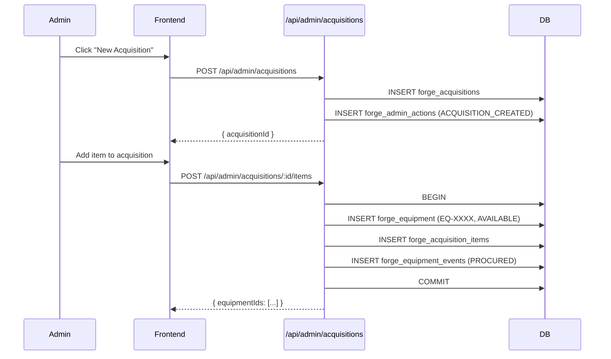

# Design Document

## Feature: Lab Assistant Lab-Specific Availability & Inventory Acquisition Workflow

### FORGE Lab Equipment Management System — TIP Manila

---

## Overview

This document covers the technical design for two related features:

**Feature 1 — AI Lab Assistant: Lab-Specific Availability**
Extends `fetchLiveContext()` in `backend/routes/ai.js` to include per-lab-room equipment availability data. The existing context already lists all equipment globally; this change adds a structured per-room section so the AI can answer room-scoped queries like "What is available in B-201 today?" without hallucinating.

**Feature 2 — Inventory Acquisition Workflow**
Adds a formal acquisition intake module: two new DB tables (`forge_acquisitions`, `forge_acquisition_items`), a new backend route file (`backend/routes/admin/acquisitions.js`), registration in `backend/index.js`, and a new admin frontend page at `/admin/acquisitions` following the existing modal-based CRUD pattern.

---

## Architecture

The system follows the existing layered architecture:

```
Frontend (React + Vite)
  └── /admin/acquisitions  →  AcquisitionsManagement.jsx
  └── /admin (AdminDashboard.jsx)  →  new nav card

Backend (Node.js / Express)
  └── /api/admin/acquisitions  →  backend/routes/admin/acquisitions.js
  └── /api/ai/chat             →  backend/routes/ai.js  (fetchLiveContext extended)

Database (PostgreSQL via pool.js)
  └── forge_acquisitions        (new)
  └── forge_acquisition_items   (new)
  └── forge_equipment           (existing — rows inserted by acquisition workflow)
  └── forge_equipment_events    (existing — PROCURED events inserted)
  └── forge_admin_actions       (existing — ACQUISITION_CREATED entries inserted)
```



---

## Components and Interfaces

### Feature 1: AI Context Extension

**Modified file:** `backend/routes/ai.js`

The `fetchLiveContext()` function is extended with a fourth parallel query that joins `forge_equipment`, `forge_equipment_events`, and `forge_transactions`/`forge_txn_items` to produce per-room availability data.

New query added to the `Promise.all` block:

```js
// Per-room equipment availability
db.query(`
  SELECT
    r.room_id,
    r.room_name,
    r.department,
    r.status AS room_status,
    e.equipment_id,
    e.name AS equipment_name,
    e.status AS equipment_status,
    CASE
      WHEN t.txn_id IS NOT NULL THEN t.time_slot
      ELSE NULL
    END AS booked_slot,
    CASE
      WHEN t.txn_id IS NOT NULL THEN u.full_name
      ELSE NULL
    END AS borrower_name
  FROM forge_lab_rooms r
  LEFT JOIN forge_equipment_events ev
    ON ev.to_location = r.room_id
    AND ev.event_type IN ('PROCURED', 'TRANSFERRED')
    AND ev.event_id = (
      SELECT MAX(ev2.event_id)
      FROM forge_equipment_events ev2
      WHERE ev2.equipment_id = ev.equipment_id
        AND ev2.event_type IN ('PROCURED', 'TRANSFERRED')
    )
  LEFT JOIN forge_equipment e ON e.equipment_id = ev.equipment_id
    AND e.status != 'DISPOSED'
  LEFT JOIN forge_txn_items ti ON ti.equipment_id = e.equipment_id
  LEFT JOIN forge_transactions t
    ON t.txn_id = ti.txn_id
    AND t.txn_date = $1
    AND t.status IN ('ACTIVE', 'PENDING_RETURN', 'CLAIM_ID')
  LEFT JOIN forge_users u ON u.user_id = t.user_id
  ORDER BY r.room_id, e.name
`, [today])
```

The result is grouped by room and formatted into a new `## Live Per-Room Equipment Availability` section appended to the context string. Each room entry lists:
- Room ID, name, department, status
- Available equipment (no active booking today): names listed
- Booked equipment: name + time slot

A summary table is also appended listing each room with `(available / total)` counts.

**New context section format:**

```
## Live Per-Room Equipment Availability — Today (YYYY-MM-DD)

### A-101 — Computer Laboratory 1 (Computer Engineering) [ACTIVE]
Available (3): Oscilloscope Tektronix TDS2024C, Digital Multimeter Fluke 87V, Bench Power Supply 30V 5A
Booked (1): Logic Analyzer Saleae Logic Pro 16 — 09:00-11:00 (borrowed by Juan Dela Cruz)

### B-201 — Electronics Laboratory (Electronics Engineering) [ACTIVE]
Available (2): Spectrum Analyzer Keysight N9320B, LCR Meter BK Precision 891
Booked (0): none

## Per-Room Summary
A-101 (Computer Laboratory 1): 3 available / 4 total
B-201 (Electronics Laboratory): 2 available / 2 total
...
```

The existing global equipment list is retained for backward compatibility with non-room-scoped queries.

---

### Feature 2: Acquisition Backend Routes

**New file:** `backend/routes/admin/acquisitions.js`

Endpoints:

| Method | Path | Description |
|--------|------|-------------|
| `GET` | `/api/admin/acquisitions` | List all acquisitions, ordered by date desc |
| `POST` | `/api/admin/acquisitions` | Create a new acquisition record |
| `GET` | `/api/admin/acquisitions/:id` | Get acquisition detail with items |
| `POST` | `/api/admin/acquisitions/:id/items` | Add item(s) to an acquisition (batch) |

All endpoints require `authenticateToken` + `requireRole('LAB_ADMIN')`.

The `POST /items` endpoint uses a `db.getConnection()` client with explicit `BEGIN`/`COMMIT`/`ROLLBACK` to ensure atomicity across the three inserts (equipment, acquisition_item, equipment_event).

**Registration in `backend/index.js`:**

```js
const adminAcquisitionsRoutes = require('./routes/admin/acquisitions');
// ...
app.use('/api/admin/acquisitions', adminAcquisitionsRoutes);
```

---

### Feature 2: Acquisition Frontend Page

**New file:** `frontend/src/pages/admin/AcquisitionsManagement.jsx`

Follows the exact same structure as `EquipmentManagement.jsx` and `LabRoomManagement.jsx`:
- Sticky header with back-to-admin navigation
- Page title + "New Acquisition" button
- Table of acquisition records (supplier, date, item count, creator)
- Modal for creating a new acquisition
- Detail view (inline expansion or separate modal) showing items with "Add Item" form
- Success/error banners with 3-second auto-dismiss for success

**Route added to `frontend/src/App.jsx`:**

```jsx
import AcquisitionsManagement from './pages/admin/AcquisitionsManagement';
// ...
<Route path="/admin/acquisitions" element={<AdminRoute><AcquisitionsManagement /></AdminRoute>} />
```

**Nav card added to `AdminDashboard.jsx`:**

```jsx
<button onClick={() => navigate('/admin/acquisitions')} ...>
  <ShoppingCart className="w-5 h-5" />
  <p>Acquisitions</p>
  <p>Manage inventory intake</p>
</button>
```

---

## Data Models

### New Table: `forge_acquisitions`

```sql
CREATE TABLE forge_acquisitions (
    acquisition_id  SERIAL PRIMARY KEY,
    supplier_name   VARCHAR(200) NOT NULL,
    acquisition_date DATE NOT NULL,
    notes           TEXT,
    created_by      INTEGER NOT NULL REFERENCES forge_users(user_id),
    created_at      TIMESTAMP DEFAULT CURRENT_TIMESTAMP
);

CREATE INDEX idx_acquisitions_date ON forge_acquisitions(acquisition_date DESC);
CREATE INDEX idx_acquisitions_created_by ON forge_acquisitions(created_by);
```

### New Table: `forge_acquisition_items`

```sql
CREATE TABLE forge_acquisition_items (
    item_id         SERIAL PRIMARY KEY,
    acquisition_id  INTEGER NOT NULL REFERENCES forge_acquisitions(acquisition_id),
    equipment_id    VARCHAR(20) NOT NULL REFERENCES forge_equipment(equipment_id),
    initial_condition VARCHAR(20) CHECK (initial_condition IN ('Excellent', 'Good', 'Fair', 'Poor')),
    assigned_room   VARCHAR(20) REFERENCES forge_lab_rooms(room_id),
    created_at      TIMESTAMP DEFAULT CURRENT_TIMESTAMP
);

CREATE INDEX idx_acq_items_acquisition ON forge_acquisition_items(acquisition_id);
CREATE INDEX idx_acq_items_equipment ON forge_acquisition_items(equipment_id);
```

### Existing Tables Modified (data only, no schema change)

- `forge_equipment`: new rows inserted with `status = 'AVAILABLE'` and auto-generated `EQ-XXXX` ID
- `forge_equipment_events`: new `PROCURED` rows with `to_location = assigned_room`
- `forge_admin_actions`: new `ACQUISITION_CREATED` rows with `target_type = 'ACQUISITION'`

### Equipment ID Generation

Reuses the existing `getUniqueEquipmentId()` helper exported from `backend/routes/admin/equipment.js`. The acquisitions route imports it:

```js
const { getUniqueEquipmentId } = require('./equipment');
```

---

## Correctness Properties

*A property is a characteristic or behavior that should hold true across all valid executions of a system — essentially, a formal statement about what the system should do. Properties serve as the bridge between human-readable specifications and machine-verifiable correctness guarantees.*

### Property 1: Per-Room Context Completeness

*For any* set of lab rooms and equipment with known assignments and today's bookings, the context string produced by `buildRoomContext()` must include, for each room, the correct count of available equipment and the names of all equipment with no active booking today.

**Validates: Requirements 1.1, 1.2, 1.5, 2.1, 2.3**

---

### Property 2: Booked Equipment Excluded from Available List

*For any* equipment item that has an active transaction today (status `ACTIVE`, `PENDING_RETURN`, or `CLAIM_ID`), the per-room context section for that item's assigned room must list it under "Booked" and must not list it under "Available".

**Validates: Requirements 1.3, 1.6**

---

### Property 3: Acquisition Creation Round-Trip

*For any* valid supplier name and acquisition date, creating an acquisition record and then retrieving it by the returned ID must yield the same supplier name, date, notes, and creator ID.

**Validates: Requirements 3.1, 3.3, 3.5**

---

### Property 4: Acquisition Creation Audit Log Invariant

*For any* acquisition record that is successfully created, the `forge_admin_actions` table must contain exactly one row with `action_type = 'ACQUISITION_CREATED'` and `target_id` equal to the new acquisition ID.

**Validates: Requirements 3.4, 7.2**

---

### Property 5: Acquisition Item Creation Round-Trip

*For any* valid item added to an existing acquisition, the resulting `forge_equipment` row must have `status = 'AVAILABLE'`, an ID matching the `EQ-XXXX` format, and the `forge_acquisition_items` table must contain a row linking that equipment ID to the acquisition.

**Validates: Requirements 4.1, 4.2**

---

### Property 6: PROCURED Event Invariant

*For any* equipment item created through the acquisition workflow, the `forge_equipment_events` table must contain exactly one `PROCURED` event for that equipment ID, with `to_location` equal to the assigned lab room and `performed_by` equal to the admin's user ID.

**Validates: Requirements 4.3, 7.1**

---

### Property 7: Batch Add Completeness

*For any* batch of N valid items submitted to `POST /api/admin/acquisitions/:id/items`, the response must contain exactly N equipment IDs, and exactly N rows must exist in both `forge_equipment` and `forge_acquisition_items` after the request completes.

**Validates: Requirements 4.6**

---

### Property 8: Batch Add Atomicity

*For any* batch add where one item insert fails (simulated), no equipment records, acquisition item records, or equipment event records from that batch must be committed to the database.

**Validates: Requirements 4.7**

---

### Property 9: Acquisitions List Ordering

*For any* set of acquisition records with distinct dates, the list endpoint must return them ordered by `acquisition_date` descending (most recent first), and each record must include supplier name, date, item count, and creator name.

**Validates: Requirements 5.1**

---

### Property 10: Acquisition Detail Round-Trip

*For any* acquisition with a known set of items, the detail endpoint must return all item equipment IDs, and the set of those IDs must equal the set of equipment IDs found in `forge_equipment_events` with `event_type = 'PROCURED'` for items belonging to that acquisition.

**Validates: Requirements 5.2, 7.4**

---

### Property 11: Acquisition Endpoints Require LAB_ADMIN Role

*For any* request to any acquisition endpoint made without a valid LAB_ADMIN token (missing token, student token, or expired token), the system must return a 4xx error and must not modify or return any acquisition data.

**Validates: Requirements 5.4**

---

### Property 12: Acquisition Item Immediately Visible in Live Context

*For any* equipment item created via the acquisition workflow, calling `fetchLiveContext()` after the acquisition is committed must include that equipment ID in the available equipment list for its assigned room.

**Validates: Requirements 7.3**

---

### Property 13: Validation Rejects Missing Acquisition Fields

*For any* acquisition creation request where supplier name is empty/whitespace or acquisition date is absent, the system must return HTTP 400 and must not create any record in `forge_acquisitions` or `forge_admin_actions`.

**Validates: Requirements 3.2**

---

### Property 14: Validation Rejects Missing Item Fields

*For any* item addition request where equipment name or department is empty/whitespace, the system must return HTTP 400 and must not create any record in `forge_equipment`, `forge_acquisition_items`, or `forge_equipment_events`.

**Validates: Requirements 4.4**

---

## Error Handling

### Backend

| Scenario | HTTP Status | Behavior |
|----------|-------------|----------|
| Missing supplier name or date | 400 | `{ error: "Supplier name is required." }` or `{ error: "Acquisition date is required." }` |
| Missing equipment name or department | 400 | `{ error: "Equipment name is required." }` or `{ error: "Department is required." }` |
| Acquisition ID not found | 404 | `{ error: "Acquisition not found." }` |
| Partial batch failure | 500 + ROLLBACK | `{ error: "Failed to add items. No changes were saved." }` |
| DB error on acquisition create | 500 | `{ error: "Failed to create acquisition." }` |
| Unauthenticated request | 401 | Existing `authenticateToken` middleware response |
| Non-admin request | 403 | Existing `requireRole` middleware response |
| `fetchLiveContext()` DB failure | — | Returns `''` (empty string); AI answers from static knowledge only |

### Frontend

- Required fields validated client-side before submission; invalid fields highlighted with red border and inline message
- API errors displayed in the existing red error banner pattern
- Success messages auto-dismiss after 3 seconds (matching existing pattern in `EquipmentManagement.jsx`)
- Network errors show a generic "Could not connect" message

---

## Testing Strategy

### Dual Testing Approach

Both unit tests and property-based tests are required. Unit tests cover specific examples and integration points; property tests verify universal correctness across randomized inputs.

### Property-Based Testing

**Library:** `fast-check` (already used in `backend/utils/atomicTransaction.test.js` and `frontend/src/test/`)

**Configuration:** Minimum 100 iterations per property test (`{ numRuns: 100 }`).

**Tag format:** `// Feature: lab-assistant-and-inventory-acquisition, Property N: <property_text>`

Each correctness property above maps to exactly one property-based test:

| Property | Test file | What is generated |
|----------|-----------|-------------------|
| P1: Per-room context completeness | `backend/utils/labRoomContext.test.js` | Random rooms, equipment, assignments |
| P2: Booked equipment excluded | `backend/utils/labRoomContext.test.js` | Random bookings for today |
| P3: Acquisition creation round-trip | `backend/utils/acquisitionRoundTrip.test.js` | Random supplier names, dates, notes |
| P4: Audit log invariant | `backend/utils/acquisitionRoundTrip.test.js` | Random acquisitions |
| P5: Item creation round-trip | `backend/utils/acquisitionItemRoundTrip.test.js` | Random item names, departments, conditions |
| P6: PROCURED event invariant | `backend/utils/acquisitionItemRoundTrip.test.js` | Random items with room assignments |
| P7: Batch add completeness | `backend/utils/acquisitionBatch.test.js` | Random batch sizes 1–20 |
| P8: Batch add atomicity | `backend/utils/acquisitionBatch.test.js` | Simulated failure at random position |
| P9: List ordering | `backend/utils/acquisitionList.test.js` | Random sets of acquisitions with dates |
| P10: Detail round-trip | `backend/utils/acquisitionList.test.js` | Random acquisitions with items |
| P11: Auth enforcement | `backend/utils/acquisitionAuth.test.js` | Random tokens (missing, student, expired) |
| P12: Live context visibility | `backend/utils/labRoomContext.test.js` | Random equipment created via acquisition |
| P13: Acquisition validation | `backend/utils/acquisitionValidation.test.js` | Empty/whitespace supplier names, missing dates |
| P14: Item validation | `backend/utils/acquisitionValidation.test.js` | Empty/whitespace names and departments |

### Unit Tests

Unit tests focus on:
- Specific examples: creating an acquisition with known data and asserting exact response shape
- Edge cases: acquisition with 0 items, room with no equipment, equipment with no room assignment
- Integration: the full `POST /items` flow with a real (test) DB client verifying all three tables are written
- Frontend: `AcquisitionsManagement.jsx` renders the acquisitions table, "New Acquisition" button, and form fields

**Framework:** Vitest (existing in both `backend/vitest.config.js` and `frontend/vitest.config.js`)

### Test Data Strategy

Property tests use pure functions extracted from route handlers (same pattern as `atomicTransaction.test.js`) to avoid requiring a live DB. The context builder (`buildRoomContext`) is extracted as a pure function that takes raw query result arrays and returns the context string, making it fully testable without DB mocks.
